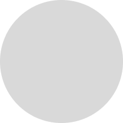

# Pin-Down 📌

### Pin-Down is extension (currently chrome only) that help to keep track of a specific position of a website. 
 

---
 

(I know the logo is shit)

 

- It was born out of frustation while I was reading a complicated post or blog (I don't remember which) and I had to scroll to a part of the website time and again.

- This extension aims to solve that issue. It works like a physical thumb pin. You can pin a specific part of website and return to that part without constant scrolling or mental breakdown.

---

## Technologies Used

 
 

---
 

## Planned:

 
 

---

 

# How To Use?

- Todo