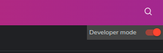
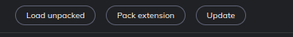
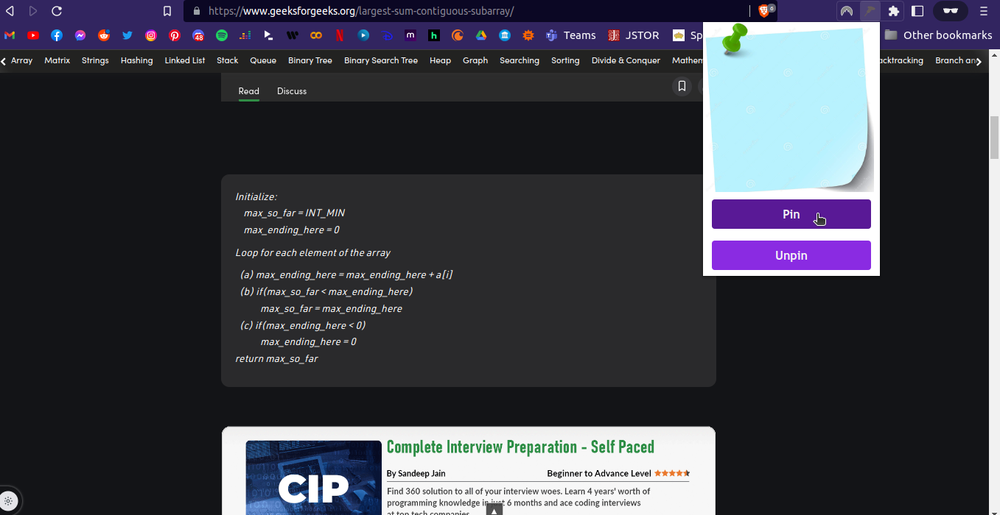
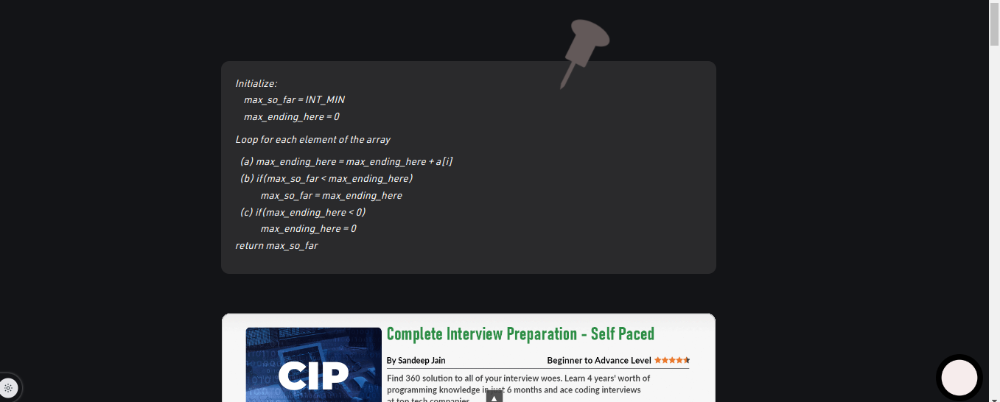

# Pin-Down 📌

### Pin-Down is extension (currently chrome only) that helps you keep track of a specific position of a website. 
 

---
 

(I know the logo is shit)

 

- It was born out of frustation while I was reading a complicated post or blog (I don't remember which) and had to scroll to a part of the website time and again.

- This extension aims to solve that issue. It works like a bookmark or tab you use in your physical books. You can pin a specific part of website and return to that part without constant scrolling or mental breakdown.

---

## Technologies Used

 
 

---

 

 

# How To install?

1. Download the latest zip file from the release section.
2. Extract the zip file in your preferred location.
3. Open chrome or any chromium-based browser and go to `chrome://extensions/`.

 

 

4. Enable developer mode.
5. Click on `Load Unpacked` and select the extracted folder.

 
6. Pin-Down is now installed.

 

---

# How to use?

1. Go to the website you want to pin.
2. Click on the extension icon.
 

 

3. Click on the `Pin` button.
4. Scroll to the part of the website you want to pin.
5. Click on any part of page you want to pin.  
5.1. A icon of `Thumb Pin` will appear on the point you clicked on the page and also a icon of magnet at the bottom right of the page.
 

 

6. Click on the `magnet` icon to return to the pinned part of the page.

7. Click on the `magnet` icon again to remove the pinned part of the page.

8. To remove the pin, click on the pin icon and click on the `Unpin` button.